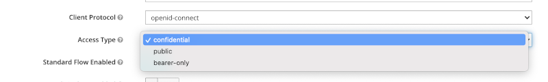
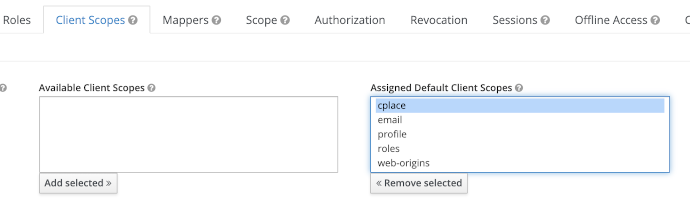
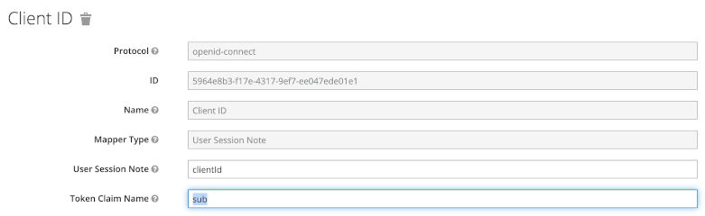

## cf.cplace.examples.oauth2client

A simple Spring Boot [CommandLineRunner](https://docs.spring.io/spring-boot/docs/current/api/org/springframework/boot/CommandLineRunner.html)
that demonstrates how to access an OAuth2 protected Spring controller in cplace.

The example uses [Keycloak](https://www.keycloak.org/) as an authorization server to retrieve a token and shows how
to configure cplace as well as the client application contained in this example to access a Spring controller based
REST endpoint in cplace.

### Setting up Keycloak

#### Running Keycloak

Running Keycloak locally is achieved easiest using docker:

``` shell
$ docker run --name keycloak -d -p 8181:8080 -e KEYCLOAK_USER=admin -e KEYCLOAK_PASSWORD=admin quay.io/keycloak/keycloak
```

Next, we'll need to configure two clients in Keycloak, one for cplace that will call Keycloak to verify the tokens it gets
and one for this example application that will call Keycloak to get the token that it will use to authenticate with cplace.

#### Creating a Client for cplace

* log in to Keycloak using the specified username and password
* create a new realm called `dev` and use it for the following actions
* create a new client scope named `example`
* create a new client named `cplace`
* set the "Access Type" of the client to "confidential"
  
  

* set "Valid Redirect URIs" to "http://localhost:8083"
* set "Authorization Enabled" to "ON"  
* on the "Client Scopes" tab of the client configuration, add the `example` client scope to the "Default Client Scopes"
  
  

#### Creating a Client for this Example Application

* log in to Keycloak using the specified username and password
* create a new realm called `dev` and use it for the following actions
* create a new client named `example-app`
* set the "Access Type" of the client to "confidential"
* set "Valid Redirect URIs" to "http://localhost:8083"
* set "Authorization Enabled" to "ON"
* on the "Client Scopes" tab of the client configuration, add the `example` client scope to the "Default Client Scopes"
* On the "Mappers" tab select the `Client ID` and map it to the token's `sub` claim:

  

* copy the client secret from the client's "Credentials" tab. This value needs to be passed to the application by either
  setting it in this example's `application.properties` file or by passing it as a system property.
* go to this example's `application.properties` file and verify that the other values are configured correctly. If you have started
  Keycloak on the same port and have named the realm, the client and the client scope as described above, no changes should
  be necessary (besides the client secret).

### Configuring cplace for Token Introspection Authentication using Opaque Tokens

In order for cplace to support opaque tokens and token introspection, the following settings must be added to cplace'
`application.yml` file. If you have followed the instructions above when configuring Keycloak, then the values shown below
should work for you, except from the `client-secret` which must be copied from the user credentials in Keycloak as
described above. 

``` yaml
cplace:
  security:
    authentication:
      opaque-token:
        enabled: true

spring:
  security:
    oauth2:
      resourceserver:
        opaque-token:
          introspection-uri: http://localhost:8181/auth/realms/dev/protocol/openid-connect/token/introspect
          client-id: cplace
          client-secret: <client secret>
```

Note that even if Keycloak will issue a JWT instead of a real opaque token, it can still be used for token introspection.
cplace can also be configured to work with JWTs and client side token validation using a certificate. Please refer to
the cplace operations manual for details on how to set this up. For this example we will use token introspection as this
is currently the more common case in cplace projects.

### Adding the 'sub' Claim to the cplace User

To make the connection between the Keycloak client, and the actual cplace user that will be used to access data
in cplace, the token's `sub` claim will be used to identify the cplace user by its LDAP ID.
In this example we are relating the technical Keycloak client 'example-app' to the cplace user 'mustermann@test.tricia'.
So our example application will act as this cplace user.
To set the LDAP ID on the cplace user, the `SetLdapIdentifierAction` can be used. Change it as displayed below and
copy it into the `admin-scripts` folder of your running cplace instance:

``` java
public class SetLdapIdentifierAction {
    public static void main(String[] args) {

        String tenantId = TenantResourcesManager.SINGLE_TENANT_ID;

        AbstractAction.doForTenant(tenantId, () -> {
            for (String[] data : new String[][]{
                    // { login, ldapIdentifier }
                    { "mustermann@test.tricia", "example-app" },
            }) {
                String login = data[0];
                String ldapIdentifier = data[1];
                updateLdapIdentifier(login, ldapIdentifier);
            }
            
            //...
        });
    }
    
    //...
}    
```


### Running the Client to access the cplace `info` REST endpoint

When running the main `OAuth2ClientApplication` class, the client should successfully connect to cplace' `info`
endpoint and output some information about the token on the console. It will also output the JSON object that was
returned by the `info` endpoint. If everything worked well, you should see that the current username is `mustermann@test.tricia`
which means that cplace would now perform all API calls as this user.

``` json
Reply: {"tenantId":"singleTenant","username":"mustermann@test.tricia","cplaceSessionId":"dummy-session","httpSessionId":null}
```

If authentication using the token generally was successful, but the username is `null`, then the LDAP property of
the `mustermann@test.tricia` was probably not set correctly as described above. Though cplace generally accepted the
authentication token, the request won't be authorized to access any cplace data.

