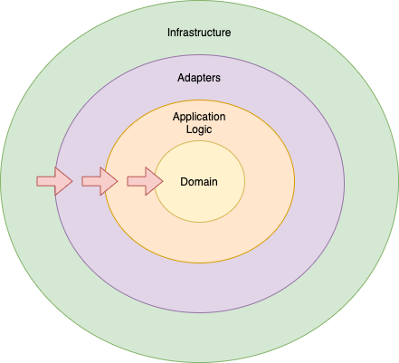

## cf.cplace.examples.spring

A plugin to demonstrate how to make use of the [Spring Framework](https://spring.io/projects/spring-framework) and
dependency injection in a cplace plugin. It is based on the example of the IMDB movie database which is also used
in cplace developer trainings.

### Table of Contents

* [cf.cplace.examples.spring](#cfcplaceexamplesspring)
 * [Table of Contents](#table-of-contents)
 * [Architectural Considerations &amp; General Package Structure](#architectural-considerations--general-package-structure)
    * [The Clean Plugin Architecture](#the-clean-plugin-architecture)
    * [The domain package](#the-domain-package)
       * [The modelpackage](#the-modelpackage)
       * [The port package](#the-port-package)
    * [The usecase package](#the-usecase-package)
    * [The adapter package](#the-adapter-package)
       * [The rest package](#the-rest-package)
       * [The cplace package](#the-cplace-package)
    * [The assembly package](#the-assembly-package)
 * [The Spring Context &amp; Dependency Injection](#the-spring-context--dependency-injection)
    * [The Plugin Bean](#the-plugin-bean)
 * [Spring Controllers](#spring-controllers)
    * [URL Mappings](#url-mappings)
    * [Error Handling](#error-handling)
    * [Security](#security)
       * [Authentication](#authentication)
       * [Authorization](#authorization)
 * [Testing](#testing)


### Architectural Considerations & General Package Structure

---
This section only points out how we organized the code in this example plugin and suggests how one
could apply a clean architecture in a plugin. Doing it like this in a smaller plugin may be an overkill though.
There is no requirement from cplace to organize plugin code like this to
work with Spring. All that is needed for this is a Spring configuration class as pointed out in
[The Spring Context & Dependency Injection](#the-spring-context--dependency-injection).

---

#### The Clean Plugin Architecture

The organization of the code in this plugin is based on Robert C. Martin's
[The Clean Architecture](https://blog.cleancoder.com/uncle-bob/2012/08/13/the-clean-architecture.html)
which aims at the separation of concerns, testability and independence of frameworks. So we propose to keep the inner
workings of your plugin separate from

* the Spring framework
* any endpoints such as REST resources or UI
* the code that connects it to the cplace platform or other systems and backends

The plugin's code is therefore organized into four different areas as depicted below. The red arrows show how the
dependencies should be organized, so they don't break the [Dependency Rule](https://blog.cleancoder.com/uncle-bob/2012/08/13/the-clean-architecture.html#the-dependency-rule).



Accordingly, the code in this example is structured into the following packages, each representing one of these areas.

#### The `domain` package

The `domain` package contains the core domain objects of the plugin which are further split into a `model`package
and a `port`package.

##### The `model`package
This package contains the core domain model (the entities) of the plugin. These can be plain data structures, objects
with functions, enums etc. Classes in this package have no dependency on Spring or cplace, they are POJOs.
For example in this plugin we have created a [Movie](src/main/java/cf/cplace/examples/spring/domain/model/Movie.java)
class that represents a core entity of our plugin.

##### The `port` package
This package contains the interfaces that allow to "plug in" concrete adapters that provide functionality for the
domain model. In this example, we have created a [MovieRepository](src/main/java/cf/cplace/examples/spring/domain/port/MovieRepository.java)
that allows to plug in the [CplaceMovieRepository](src/main/java/cf/cplace/examples/spring/adapter/cplace/CplaceMovieRepository.java)
which in turn provides the concrete implementation to store [Movie](src/main/java/cf/cplace/examples/spring/domain/model/Movie.java)
instances in cplace.

#### The `usecase` package
The plugin specific business rules are contained within this package. In our example plugin we have use cases such as
[create movie](src/main/java/cf/cplace/examples/spring/usecase/CreateMovieUseCase.java) or
[add director to movie](src/main/java/cf/cplace/examples/spring/usecase/AssignDirectorUseCase.java)

#### The `adapter` package

The `adapter` package contains the code that connects the plugin's application logic with "the outside world". In this
example we have implemented two adapters, a simple [REST resource](src/main/java/cf/cplace/examples/spring/adapter/rest)
which adapts incoming REST calls to the plugin's business logic and a
[cplace adapter](src/main/java/cf/cplace/examples/spring/adapter/cplace) which integrates the plugin with the cplace platform.

##### The `rest` package

A REST resource that is implemented as a Spring `@RestController`. In this example we have decided not to return the domain
object directly but to return representations of them. This required some extra mapping code, but it has advantages:

* the objects returned by the REST could be adapted to what the UI really needs. E.g. we could decide to transmit only
  a subset of the original model object's attributes. Or to combine them in a certain way.
* it allows adding instructions on how to render the data in JSON without having to "pollute" our domain objects with that. 

```Java
public final class DirectorRepresentation {

    //...

    @JsonFormat(pattern="yyyy-MM-dd") // how to render the date in JSON
    public LocalDate getBirthday() {
        return birthday;
    }
}
```

##### The `cplace` package

A repository implementation that implements the plugin's [ports](#the-port-package) and allows to store the plugin's
POJO model objects in cplace. This code should be pretty familiar to experienced cplace developers. One fact is
worth mentioning though: the familiar cplace exceptions that could be thrown when reading and writing cplace entities such as
the `EntityNotFoundException` and the `ProtectedEntityException` don't need to be dealt with here. Thanks to the global
cplace exception handler for controllers, we don't need to worry about any of the `CpaceException`s here.
See [Error Handling](#error-handling) for more details in this.

Also note that for simplicity the example uses the cplace root workspace which will of course not work in a productive
environment. So in your project you most likely will need a repository implementation for workspaces too.

#### The `assembly` package

The `assembly` package contains the Spring infrastructure code that defines how all the plugin's components are
assembled. This is also the place where dependency injection comes into play. See
[The Spring Context & Dependency Injection](#the-spring-context--dependency-injection) below.

### The Spring Context & Dependency Injection

---
This example plugin's Spring configuration can be found [here](src/main/java/cf/cplace/examples/spring/assembly/PluginSpringConfiguration.java).

---

During start-up, cplace will collect the class named `<plugin package>.assembly.PluginSpringConfiguration` of each plugin
if it is present. If it is not present, the plugin will simply not be considered for cplace Spring context, and
will just be interpreted as a traditional cplace plugin. The class should be annotated with Spring's `@Configuration` annotation
and can contain anything that a typical Spring configuration can contain, most importantly the bean definitions, of course.
In this example we have decided to keep our core application logic class independent of the framework (see [The Clean Architecture](#the-clean-plugin-architecture)
above). That's why they all need to be instantiated explicitly in the Spring configuration. Of course dependency injection
works in Spring configuration files:

```Java
@Configuration
public class PluginSpringConfiguration {

    @Bean
    public MovieRepository movieRepository() {
        return new CplaceMovieRepository();
    }

    @Bean
    public MovieApplication movieApplication(MovieRepository movieRepository) { // MovieRepository instance injected here by Spring
        return new MovieApplication(movieRepository);
    }
    
    // ...
}
```

However, if you want to have it more convenient and don't mind so much having Spring annotations in your core plugin classes,
the Spring component scan can also be used. Make sure that you apply it to your plugin only though!

For example, you could have all classes in your plugin scanned for potential Spring components. In that case the
`PluginSpringConfiguration`'s only purpose is to carry the annotation. Apart from that it's empty.

```Java
@Configuration
@ComponentScan("cf.cplace.examples")
public class PluginSpringConfiguration {
}
```

Of course, for your components to be picked up and instantiated by Spring in this case, they need to be annotated accordingly.
Any of Spring's well known stereotypes work here (`@Component`, `@Service`, `@Repository`, `@Controller`).

```Java
@Component
public class MovieApplication {
    // ...
}
```

Also, a matter of taste might be, how you want to have your component's dependencies injected in this case. We have 
opted for constructor injection in this example plugin as we believe it improves testability. However, everything that
Spring supports is also supported by cplace:

```Java
import org.springframework.beans.factory.annotation.Autowired;
import javax.inject.Inject;
        
@RestController
public class MovieResource {

    @Autowired // Spring annotations work
    private final FindMovieUseCase findMovieUseCase;

    @Inject // standard Java annotations work
    private final CreateMovieUseCase createMovieUseCase;
    
    public MovieResource(@Autowired FindMovieUseCase findMovieUseCase) { // constructor injection works
        // ...
    }
}
```

A middle course could be to keep the core application and model classes free os Spring and to instantiate them manually
as shown in this example while applying the component scan to packages that contain Spring code anyway, such as our
REST resource, which is a Spring `@RestController` (note that a `@RestController` also is a `@Controller`).

```Java
// component scan for a sub-package only
@ComponentScan("cf.cplace.examples.adapter.rest")
public class PluginSpringConfiguration {
    
    // this is needed as MovieApplication is free of Spring annotations
    @Bean
    public MovieApplication movieApplication(MovieRepository movieRepository) {
        return new MovieApplication(movieRepository);
    }
    
//    This is not needed, it will be picked up by the component scan now.
//    @Bean
//    public MovieResource movieResource(MovieApplication movieApplication) {
//        return new MovieResource(movieApplication, movieApplication);
//    }
}
```

#### The Plugin Bean

cplace will at start-up also silently register your plugin class (i.e. the class in your plugin code that extends
`cf.cplace.platform.services.Plugin`) as a Spring bean. Therefore, it could theoretically also be injected into your
components:

```Java
@Bean
public MovieApplication movieApplication(
        MovieRepository movieRepository,
        SpringPlugin springPugin) { // Spring will inject our plugin instance
    // ...    
}
```

However, doing so may violate the plugin's [Clean Architecture](#the-clean-plugin-architecture).

### Spring Controllers

---
This example plugin's Spring controller can be found [here](src/main/java/cf/cplace/examples/spring/adapter/rest/MovieResource.java).

---

In cplace, Spring controllers can be defined just like standard Spring controllers, including `@RequestMapping`,
`@PathVariable`, `@RequestParam`, `@ResponseStatus` and many more things. There is only speciality to cplace, however.
*cplace Spring controller classes must be annotated with `@CplaceRequestMapping` and the annotations `path`
attribute must have your plugins qualified name as first element:

```Java
@RestController
@CplaceRequestMapping(path = "/cf.cplace.examples.spring/movie")
public class MovieResource {
    //...
}
```

This has the following reasons:

* your plugin's resources should be unique and not collide with resources of other plugins nor with those of traditional
  cplace handlers.
* depending on cplace's configuration and operation mode, all resources may need to be prefixed e.g. with the cplace
  context, a tenant ID etc.
  
By using the `@CplaceRequestMapping` the cplace platform will take care of these issues for you. 

#### URL Mappings

As described above, the `path` specified in `@CplaceRequestMapping` is relative to the cplace root context. The following
cplace properties affect the controllers final URL:

* `cplace.context` (defaults to `/intern/tricia` on local development systems and to `/` on production systems)
* `cplace.isMultiTenancy` (defaults to `false` on local development systems)
* `cplace.webEndpointPathElement` (defaults to `cplace-api`, used to distinguish the Spring controller resources form the
  traditional cplace handler resources)
  
On a single tenant system, your controller's full paths typically look as follows:

`/<cplace.context>/<cplace.webEndpointPathElement>/<qualified plugin name>`

which in our example translates to

`http://localhost:8083/intern/tricia/cplace-api/cf.cplace.examples.spring`

on a local development system and if none of the above properties deviates from its default value.

On a multi tenant system, the path also contains the tenant ID:

`/<cplace.context>/<tenant ID>/<cplace.webEndpointPathElement>/<qualified plugin name>`

which in our example translates to

`http://localhost:8083/intern/tricia/tricia/cplace-api/cf.cplace.examples.spring`

on a local development system and if none of the above properties deviates from its default value and `tricia` being
the default tenant ID on local development systems.

Beyond this constraint, your Spring controller can now freely define URL mappings. E.g., in order to provide movies,
you could do:

```Java
@CplaceRequestMapping(path = "/cf.cplace.examples.spring/movie")
public class MovieResource {
    
    @GetMapping(value = {"/{id}"}, produces = MediaType.APPLICATION_JSON_VALUE)
    @ResponseStatus(HttpStatus.OK)
    public MovieRepresentation findById(@PathVariable("id") String id) {
        // ...
    }
}
```
Assuming the defaults above, a concrete movie resource might be available at

`http://localhost:8083/intern/tricia/tricia/cplace-api/cf.cplace.examples.spring/movie/hhbu393jjtqpbd2grvsgx61um`

in this case.

Note that all resources are secured by cplace per default. See [Security](#security) for more details on this.

#### Validation

Requests can be validated with standard Spring mechanisms. For example, in the following method the `id` will never
be `null`. Using the `@PathVariable` annotation like shown guarantees that because its `required` attribute defaults
to `true`. If the ID is not provided, Spring will automatically refuse to accept the request with an appropriate HTTP code.

```Java
@GetMapping(value = {"/{id}"}, produces = MediaType.APPLICATION_JSON_VALUE)
@ResponseStatus(HttpStatus.OK)
public MovieRepresentation findById(@PathVariable("id") String id) {
    //...
}
```

To validate the request body, Java bean validation can be used. To make use of it, the following dependencies
have to be added to `build.gradle`:

```Groovy
    implementation 'javax.validation:validation-api'
    implementation 'org.hibernate.validator:hibernate-validator'
```

Now, the `javax.validation` annotations can be used on the classes that represent the request body:

```Java
public final class CreateMovieRequest {
    private String name;

    @NotNull(message = "name is required")
    public String getName() {
        return name;
    }

    //...
}
```

Now all that is needed to actually validate the request body is an additional `@Valid` annotation on each parameter
that needs to be validated:

```Java
@RestController
@CplaceRequestMapping(path = "/cf.cplace.examples.spring/movie")
public class MovieResource {

    //...

    @PostMapping(consumes = MediaType.APPLICATION_JSON_VALUE)
    @ResponseStatus(HttpStatus.CREATED)
    public String create(@Valid @RequestBody CreateMovieRequest createMovieRequest) { // use @Valid to validate the request body!
        return createMovieUseCase.create(createMovieRequest.getName());
    }
    
    // ...
}
```

If the validation fails, the method is not even invoked by the Spring framework, and an appropriate HTTP code 400 (BAD REQUEST)
is returned.

#### Error Handling

---
This example plugin's error handler for controllers can be found [here](src/main/java/cf/cplace/examples/spring/adapter/rest/GlobalExceptionHandler.java).

---

Again, there is nothing cplace specific to handling errors in your Spring controllers, any Spring best practice can be applied.
One of them is to write a global `@ControllerAdvice` that deals with all the exceptions that might occur in any of your plugin's
Spring controllers as we have done in this example plugin:

```Java
@ControllerAdvice
@Order(Ordered.HIGHEST_PRECEDENCE) // prefer this over the default cplace exception handler
public class GlobalExceptionHandler {

    @ExceptionHandler(MyCustomPluginException.class) // an exception that is defined withing the plugin
    protected ResponseEntity<Error> handle(MyCustomPluginException notFoundException) {
        return createErrorResponse(notFoundException.getMessage(), HttpStatus.INTERNAL_SERVER_ERROR); // choose appropriate HTTP response code here
    }
}
```

Note that cplace itself already has a `@ControllerAdvice` that serves as a fallback and handles all cplace core exceptions
as well as exceptions that might not have been handled so far as well: 

```Java
@ControllerAdvice
public class GlobalRestExceptionHandler extends ResponseEntityExceptionHandler {
    
    // ...
    
    /**
     * Handles all exceptions for which there is no specific handler by returning a general INTERNAL_SERVER_ERROR
     * status code and a JSON response with a generic error message.
     */
    @ExceptionHandler(Exception.class)
    @ResponseBody
    protected ResponseEntity<ApiError> handleGeneralExceptions(Exception ex) {
      return apiError(INTERNAL_SERVER_ERROR, ex, "Unexpected internal server error");
    }

    @ExceptionHandler(EntityNotFoundException.class)
    @ResponseBody
    protected ResponseEntity<ApiError> handleNotFound(EntityNotFoundException ex) {
        return apiError(NOT_FOUND, ex, ex.getMessage());
    }
    
    // others...
}
```

This has the following consequences for your plugin's exception handler:

* *it should only handle exceptions that are defined in the plugin*, otherwise it will interfere with the exception handlers
  of other plugins or with the global cplace exception handler.
* your `@ControllerAdvice` must have higher precedence than the default cplace exception handler otherwise the cplace
  exception handler for the `Exception` class will handle your exceptions. (see `@Order(Ordered.HIGHEST_PRECEDENCE)` above)

#### Security

##### Authentication

The cplace Spring controllers are secured by [Spring Security](https://docs.spring.io/spring-security/site/docs/current/reference/html5/).
The [Spring Security Architecture](https://spring.io/guides/topicals/spring-security-architecture) topical guide provides
a good introduction to this.

On production systems, cplace secures all endpoints that are created through Spring controllers and provides no way to
access them per default. Access has to be enabled in one of the following ways:

* by adding one of the cplace authentication plugins
* by providing your own authentication provider.
* by enabling Basic Authentication in the cplace platform through setting the property `cplace.security.basic.enabled=true`.
  It authenticates against the cplace user management. *Basic Authentication is not recommended on production systems, however!*

When running cplace in test mode a Basic Authentication provider is enabled per default.

Custom authentication is added the easiest by registering your custom implementation of a
`org.springframework.security.authentication.AuthenticationProvider` as a Spring bean. Also have a look at
`cf.cplace.platform.application.security.BasicAuthenticationProvider` to get some pointers on how to do this.

##### Authorization

If the `AuthentocationProvider`'s `authenticate` method returns an `Authentication` instance which in turn has a principle
of type `cf.cplace.platform.internal.api.security.CplaceUserDetails`, then cplace will automatically log in this
user with the cplace session (see `cf.cplace.platform.application.rest.SessionAndRequestLocalInterceptor` for details).
This will 'hook' the current thread into the cplace authorization system. So any attempt to read or write cplace
entities from within Spring controllers will now be checked against the cplace authorization system.

### Testing

Having implemented the plugin's core functionality as POJOs and independent form the REST endpoints as well as from
the cplace interface code as described in
[Architectural Considerations & General Package Structure](#architectural-considerations--general-package-structure),
allows us to test the plugin's core functionality with plain JUnit tests. Each component's dependency can easily be
mocked either with either POJOs or with Mockito, as shown for example in
[MovieApplicationTest](src/test/java/cf/cplace/examples/spring/usecase/impl/MovieApplicationTest.java).

The cplace adapter on the other hand can also be tested independently of our plugin. Testing the adapter through our
domain interfaces documents and verifies the assumptions we rely on when it comes to cplace functionality. An
example of such a test can be found in
[CplaceMovieRepositoryTest](src/test/java/cf/cplace/examples/spring/adapter/cplace/CplaceMovieRepositoryTest.java).

Note, that when we instantiate the cplace `StartServerRule` with the test's instance as a constructor argument, then we
can have any of the beans that we defined in the Spring context injected into our test:

```Java
public class CplaceMovieRepositoryTest {
    @Rule
    public TestRule startServer = new StartServerRule(this); // pass 'this' as the argument

    @Inject
    private MovieRepository movieRepository; // injected by Spring

    @Inject
    private DirectorRepository directorRepository; // injected by Spring
    
    // tests here
}
```
